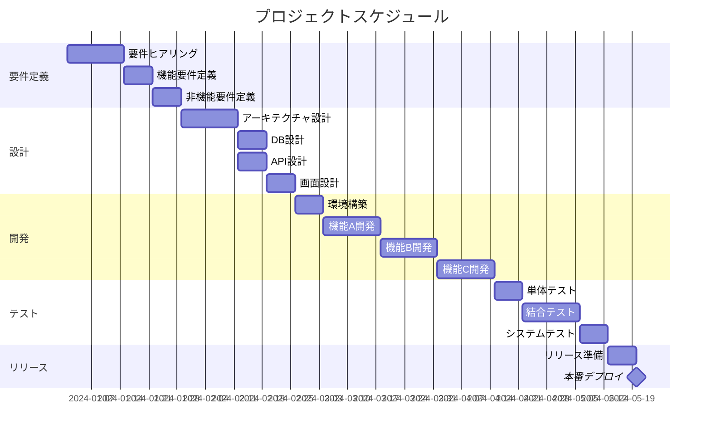

# スケジュール

## マイルストーン

| # | マイルストーン | 予定日 | 完了日 | ステータス | 備考 |
|---|--------------|--------|-------|-----------|------|
| M1 | 要件定義完了 | YYYY-MM-DD | | 未着手 | |
| M2 | 基本設計完了 | YYYY-MM-DD | | 未着手 | |
| M3 | 詳細設計完了 | YYYY-MM-DD | | 未着手 | |
| M4 | 開発完了 | YYYY-MM-DD | | 未着手 | |
| M5 | テスト完了 | YYYY-MM-DD | | 未着手 | |
| M6 | リリース | YYYY-MM-DD | | 未着手 | |

**ステータス**: 未着手 / 進行中 / 完了 / 遅延

## フェーズ別スケジュール

### フェーズ1: 要件定義

| タスク | 担当 | 開始日 | 終了日 | 進捗 |
|--------|------|-------|-------|------|
| 要件ヒアリング | | | | 0% |
| 機能要件定義 | | | | 0% |
| 非機能要件定義 | | | | 0% |
| 要件レビュー | | | | 0% |

### フェーズ2: 設計

| タスク | 担当 | 開始日 | 終了日 | 進捗 |
|--------|------|-------|-------|------|
| アーキテクチャ設計 | | | | 0% |
| DB設計 | | | | 0% |
| API設計 | | | | 0% |
| 画面設計 | | | | 0% |
| 設計レビュー | | | | 0% |

### フェーズ3: 開発

| タスク | 担当 | 開始日 | 終了日 | 進捗 |
|--------|------|-------|-------|------|
| 環境構築 | | | | 0% |
| 機能A開発 | | | | 0% |
| 機能B開発 | | | | 0% |
| 機能C開発 | | | | 0% |
| コードレビュー | | | | 0% |

### フェーズ4: テスト

| タスク | 担当 | 開始日 | 終了日 | 進捗 |
|--------|------|-------|-------|------|
| 単体テスト | | | | 0% |
| 結合テスト | | | | 0% |
| システムテスト | | | | 0% |
| UAT | | | | 0% |
| 不具合修正 | | | | 0% |

### フェーズ5: リリース

| タスク | 担当 | 開始日 | 終了日 | 進捗 |
|--------|------|-------|-------|------|
| リリース準備 | | | | 0% |
| 本番デプロイ | | | | 0% |
| 動作確認 | | | | 0% |
| ドキュメント整備 | | | | 0% |

## ガントチャート

## リスク・課題

| # | 内容 | 影響度 | 対策 | ステータス |
|---|------|-------|------|-----------|
| 1 | | 高/中/低 | | オープン |
| 2 | | 高/中/低 | | オープン |

---

**最終更新**: YYYY-MM-DD
**更新者**: {名前}
