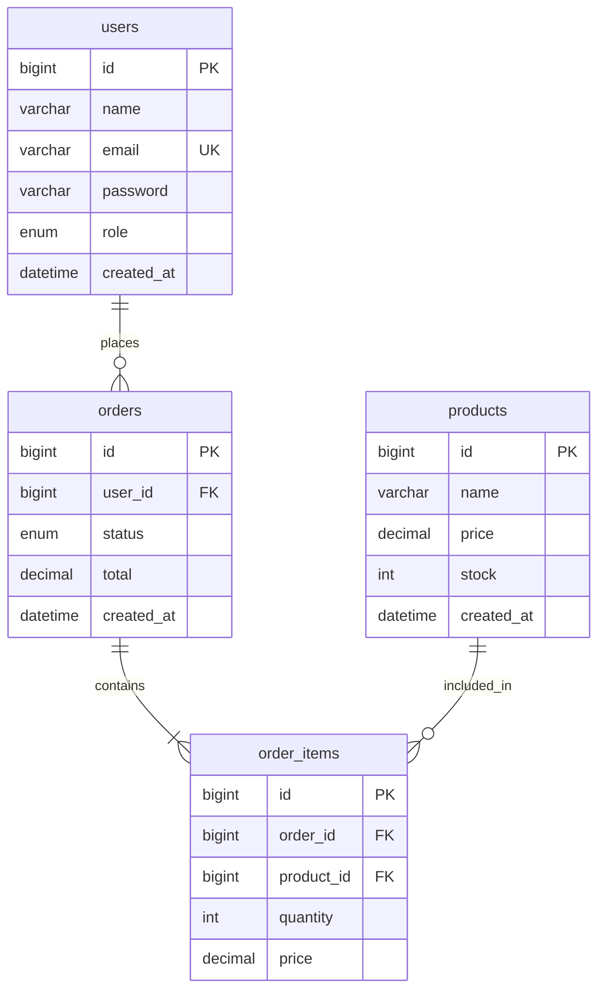

# DB設計

## 概要

{データベース設計の概要を記載}

---

## ER図

---

## テーブル一覧

| # | テーブル名 | 論理名 | 概要 | 備考 |
|---|-----------|-------|------|------|
| 1 | users | ユーザー | ユーザー情報 | |
| 2 | products | 商品 | 商品マスタ | |
| 3 | orders | 注文 | 注文ヘッダ | |
| 4 | order_items | 注文明細 | 注文明細 | |
| 5 | categories | カテゴリ | カテゴリマスタ | |

---

## テーブル定義

### users（ユーザー）

| # | カラム名 | 論理名 | 型 | NULL | デフォルト | 備考 |
|---|---------|-------|-----|------|-----------|------|
| 1 | id | ID | BIGINT | NO | AUTO | PK |
| 2 | name | 名前 | VARCHAR(100) | NO | | |
| 3 | email | メール | VARCHAR(255) | NO | | UNIQUE |
| 4 | password | パスワード | VARCHAR(255) | NO | | ハッシュ化 |
| 5 | role | 権限 | ENUM | NO | 'user' | admin, user |
| 6 | status | ステータス | ENUM | NO | 'active' | active, inactive |
| 7 | created_at | 作成日時 | DATETIME | NO | CURRENT | |
| 8 | updated_at | 更新日時 | DATETIME | NO | CURRENT | ON UPDATE |
| 9 | deleted_at | 削除日時 | DATETIME | YES | NULL | 論理削除 |

**インデックス**:
- PRIMARY KEY (id)
- UNIQUE KEY (email)
- KEY (status)

---

### products（商品）

| # | カラム名 | 論理名 | 型 | NULL | デフォルト | 備考 |
|---|---------|-------|-----|------|-----------|------|
| 1 | id | ID | BIGINT | NO | AUTO | PK |
| 2 | category_id | カテゴリID | BIGINT | YES | NULL | FK |
| 3 | name | 商品名 | VARCHAR(200) | NO | | |
| 4 | description | 説明 | TEXT | YES | NULL | |
| 5 | price | 価格 | DECIMAL(10,0) | NO | | |
| 6 | stock | 在庫数 | INT | NO | 0 | |
| 7 | status | ステータス | ENUM | NO | 'draft' | draft, active, sold_out |
| 8 | created_at | 作成日時 | DATETIME | NO | CURRENT | |
| 9 | updated_at | 更新日時 | DATETIME | NO | CURRENT | ON UPDATE |

**インデックス**:
- PRIMARY KEY (id)
- KEY (category_id)
- KEY (status)
- FULLTEXT KEY (name, description)

---

### orders（注文）

| # | カラム名 | 論理名 | 型 | NULL | デフォルト | 備考 |
|---|---------|-------|-----|------|-----------|------|
| 1 | id | ID | BIGINT | NO | AUTO | PK |
| 2 | user_id | ユーザーID | BIGINT | NO | | FK |
| 3 | order_number | 注文番号 | VARCHAR(20) | NO | | UNIQUE |
| 4 | status | ステータス | ENUM | NO | 'pending' | pending, paid, shipped, completed, cancelled |
| 5 | subtotal | 小計 | DECIMAL(10,0) | NO | | |
| 6 | tax | 消費税 | DECIMAL(10,0) | NO | | |
| 7 | total | 合計 | DECIMAL(10,0) | NO | | |
| 8 | ordered_at | 注文日時 | DATETIME | NO | CURRENT | |
| 9 | created_at | 作成日時 | DATETIME | NO | CURRENT | |
| 10 | updated_at | 更新日時 | DATETIME | NO | CURRENT | ON UPDATE |

**インデックス**:
- PRIMARY KEY (id)
- UNIQUE KEY (order_number)
- KEY (user_id)
- KEY (status)
- KEY (ordered_at)

---

### order_items（注文明細）

| # | カラム名 | 論理名 | 型 | NULL | デフォルト | 備考 |
|---|---------|-------|-----|------|-----------|------|
| 1 | id | ID | BIGINT | NO | AUTO | PK |
| 2 | order_id | 注文ID | BIGINT | NO | | FK |
| 3 | product_id | 商品ID | BIGINT | NO | | FK |
| 4 | quantity | 数量 | INT | NO | | |
| 5 | unit_price | 単価 | DECIMAL(10,0) | NO | | 注文時点の価格 |
| 6 | subtotal | 小計 | DECIMAL(10,0) | NO | | |
| 7 | created_at | 作成日時 | DATETIME | NO | CURRENT | |

**インデックス**:
- PRIMARY KEY (id)
- KEY (order_id)
- KEY (product_id)

---

## 命名規則

| 対象 | 規則 | 例 |
|------|------|-----|
| テーブル名 | スネークケース、複数形 | users, order_items |
| カラム名 | スネークケース | user_id, created_at |
| 主キー | id | id |
| 外部キー | {テーブル名単数}_id | user_id |
| 日時 | _at 接尾辞 | created_at, deleted_at |
| フラグ | is_ 接頭辞 | is_active, is_verified |

---

## 共通カラム

すべてのテーブルに以下を設定：

| カラム名 | 型 | 説明 |
|---------|---|------|
| created_at | DATETIME | レコード作成日時 |
| updated_at | DATETIME | レコード更新日時 |

論理削除を行うテーブルには以下も追加：

| カラム名 | 型 | 説明 |
|---------|---|------|
| deleted_at | DATETIME | 論理削除日時（NULL=未削除） |

---

**最終更新**: YYYY-MM-DD
**更新者**: {名前}
