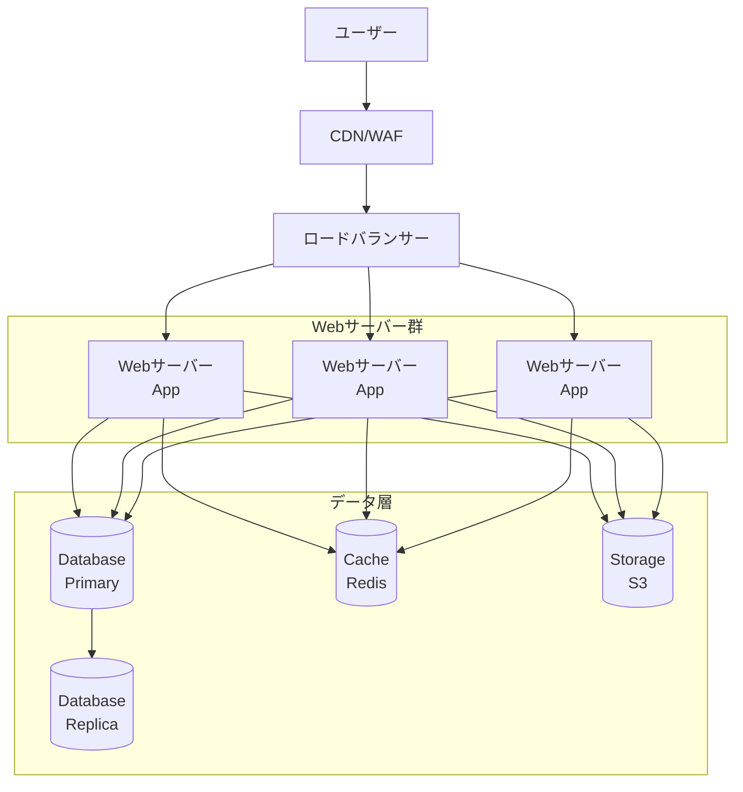
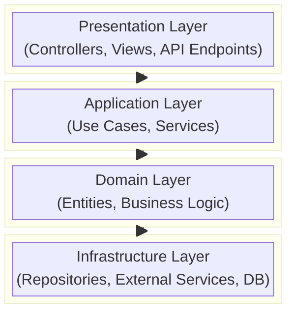
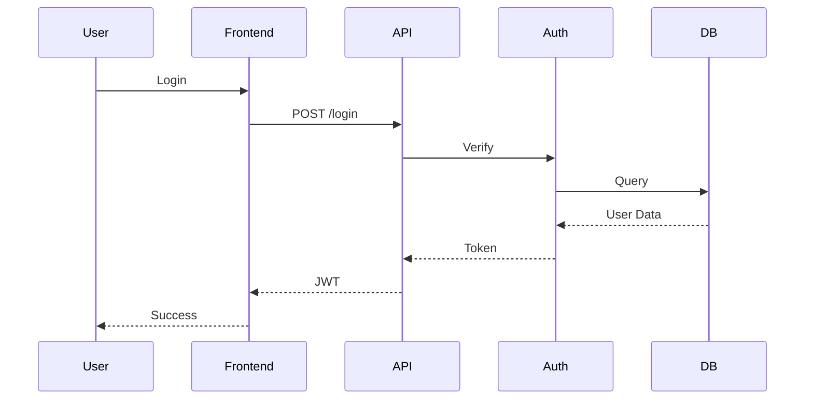
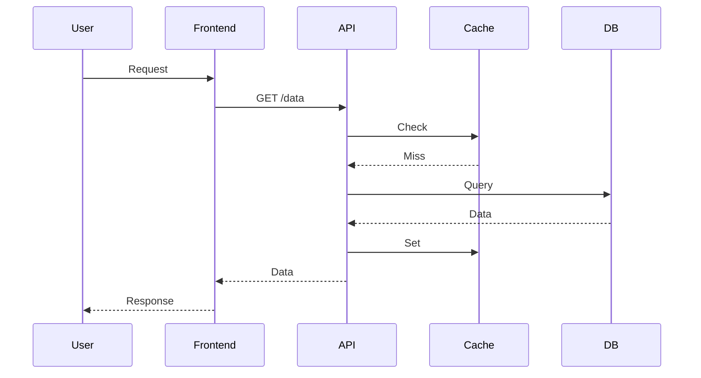

# アーキテクチャ設計

## 概要

{システムアーキテクチャの概要を記載}

---

## システム構成図

---

## レイヤー構成

---

## コンポーネント構成

| コンポーネント | 役割 | 技術 | 備考 |
|--------------|------|------|------|
| Frontend | ユーザーインターフェース | | |
| API Gateway | リクエスト振り分け | | |
| Auth Service | 認証・認可 | | |
| Core Service | 主要ビジネスロジック | | |
| Notification | 通知処理 | | |
| Batch | バッチ処理 | | |

---

## 技術選定

### フロントエンド

| 項目 | 選定技術 | 選定理由 |
|------|---------|---------|
| フレームワーク | | |
| 状態管理 | | |
| UIライブラリ | | |
| ビルドツール | | |

### バックエンド

| 項目 | 選定技術 | 選定理由 |
|------|---------|---------|
| 言語 | | |
| フレームワーク | | |
| ORM | | |
| 認証 | | |

### データベース

| 項目 | 選定技術 | 選定理由 |
|------|---------|---------|
| RDBMS | | |
| キャッシュ | | |
| 検索エンジン | | |

### インフラ

| 項目 | 選定技術 | 選定理由 |
|------|---------|---------|
| クラウド | | |
| コンテナ | | |
| オーケストレーション | | |
| CI/CD | | |

---

## 通信フロー

### 認証フロー

### データ取得フロー

---

## セキュリティ設計

### 認証・認可

| 項目 | 方式 | 備考 |
|------|------|------|
| 認証方式 | JWT | 有効期限1時間 |
| リフレッシュトークン | あり | 有効期限7日 |
| 認可方式 | RBAC | ロールベース |

### 通信セキュリティ

| 項目 | 方式 | 備考 |
|------|------|------|
| HTTPS | TLS 1.3 | |
| CORS | 許可オリジン制限 | |
| CSP | 設定あり | |

---

## 可用性設計

| 項目 | 設計 | 備考 |
|------|------|------|
| Webサーバー | 3台構成 | オートスケール |
| DBサーバー | Primary-Replica | 自動フェイルオーバー |
| キャッシュ | クラスター構成 | |

---

## 監視設計

| 対象 | 監視項目 | ツール |
|------|---------|-------|
| インフラ | CPU, Memory, Disk | CloudWatch |
| アプリ | エラー率, レスポンス | Datadog |
| ログ | エラーログ | CloudWatch Logs |

---

**最終更新**: YYYY-MM-DD
**更新者**: {名前}
