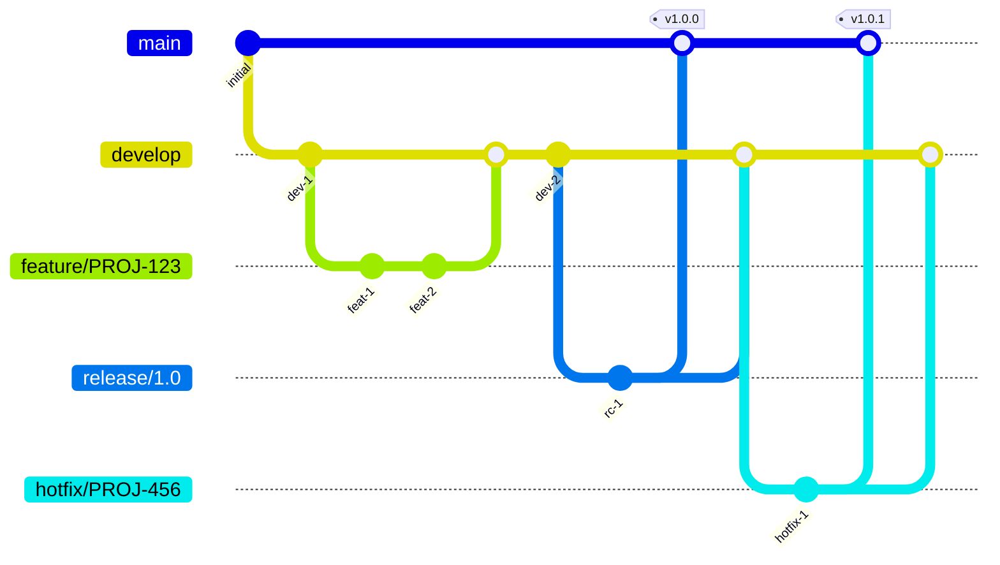

# 開発ガイド

## 概要

本プロジェクトの開発フローとルールを記載します。

---

## 開発フロー

### 1. タスクの開始

1. Jiraでタスクを確認
2. ステータスを「進行中」に変更
3. 担当者を自分に設定

### 2. ブランチ作成

```bash
# developブランチを最新化
git checkout develop
git pull origin develop

# 機能ブランチを作成
git checkout -b feature/{チケット番号}-{機能名}

# 例
git checkout -b feature/PROJ-123-user-authentication
```

### 3. 開発

- コーディング規約に従って実装
- こまめにコミット
- テストを書く

### 4. プルリクエスト作成

```bash
# 変更をプッシュ
git push origin feature/PROJ-123-user-authentication
```

GitHubでPRを作成

### 5. コードレビュー

- レビュアーをアサイン
- 指摘事項を修正
- 承認を得る

### 6. マージ

- Squash and mergeを使用
- ブランチを削除

---

## ブランチ戦略



### ブランチ命名規則

| 種類 | 形式 | 例 |
|------|------|-----|
| 機能 | feature/{チケット番号}-{機能名} | feature/PROJ-123-login |
| バグ修正 | bugfix/{チケット番号}-{内容} | bugfix/PROJ-456-fix-validation |
| 緊急修正 | hotfix/{チケット番号}-{内容} | hotfix/PROJ-789-security-patch |
| リリース | release/{バージョン} | release/1.2.0 |

---

## コミットメッセージ

### 形式

```
<type>(<scope>): <subject>

<body>

<footer>
```

### Type

| Type | 用途 |
|------|------|
| feat | 新機能 |
| fix | バグ修正 |
| docs | ドキュメント変更 |
| style | フォーマット変更（動作に影響なし） |
| refactor | リファクタリング |
| test | テスト追加・修正 |
| chore | ビルド・ツール変更 |

### 例

```
feat(auth): ユーザー認証機能を追加

- JWTによる認証を実装
- リフレッシュトークン機能を追加
- ログアウト処理を実装

Refs: PROJ-123
```

```
fix(user): メールアドレスのバリデーションを修正

空文字が許可されていた問題を修正

Fixes: PROJ-456
```

---

## プルリクエスト

### タイトル

```
[PROJ-123] ユーザー認証機能を追加
```

### 本文テンプレート

```markdown
## 概要
{変更内容の概要}

## 変更種別
- [ ] 新機能
- [ ] バグ修正
- [ ] リファクタリング
- [ ] ドキュメント

## 変更内容
- {変更点1}
- {変更点2}

## テスト
- [ ] 単体テスト追加
- [ ] 動作確認済み

## レビュー観点
- {特に見てほしいポイント}

## 関連チケット
- PROJ-123
```

### レビュールール

| 項目 | ルール |
|------|-------|
| 必要承認数 | 1名以上 |
| レビュアー | チームメンバーから1名以上 |
| CI | すべてのチェックがパス |
| コンフリクト | 解消済みであること |

---

## テスト

### テストの種類

| 種類 | 対象 | ツール |
|------|------|--------|
| 単体テスト | 関数・クラス | Jest |
| 結合テスト | API・DB連携 | Jest + Supertest |
| E2Eテスト | ユーザーフロー | Playwright |

### テストファイル配置

```
src/
├── services/
│   └── user.service.ts
└── __tests__/
    └── services/
        └── user.service.test.ts
```

### テストの命名

```typescript
describe('UserService', () => {
  describe('createUser', () => {
    it('正常にユーザーを作成できる', async () => {
      // ...
    });

    it('メールアドレスが重複している場合はエラーを返す', async () => {
      // ...
    });
  });
});
```

### カバレッジ目標

| 対象 | 目標 |
|------|------|
| 全体 | 80%以上 |
| 新規コード | 90%以上 |
| クリティカルパス | 100% |

---

## デプロイ

### 環境

| 環境 | ブランチ | 自動デプロイ | URL |
|------|---------|------------|-----|
| 開発 | develop | ○ | https://dev.example.com |
| ステージング | release/* | ○ | https://stg.example.com |
| 本番 | main | × (承認必要) | https://example.com |

### デプロイフロー

```
1. developにマージ → 開発環境に自動デプロイ
2. release/x.x.xブランチ作成 → ステージング環境に自動デプロイ
3. ステージングで動作確認
4. mainにマージ → 承認後、本番環境にデプロイ
5. タグを作成 (v1.2.0)
```

---

## 障害対応

### 対応フロー

1. **検知**: 監視アラートまたはユーザー報告
2. **一次対応**: 状況確認、影響範囲の特定
3. **エスカレーション**: 必要に応じて上位者に報告
4. **修正**: hotfixブランチで対応
5. **デプロイ**: 緊急リリース
6. **振り返り**: 原因分析、再発防止策

### Hotfix手順

```bash
# mainから直接ブランチを作成
git checkout main
git pull origin main
git checkout -b hotfix/PROJ-999-critical-fix

# 修正後
git push origin hotfix/PROJ-999-critical-fix

# PR作成 → mainにマージ → タグ作成
# developにもマージ
```

---

## ツール

### 開発ツール

| ツール | 用途 |
|--------|------|
| VS Code | エディタ |
| Docker | コンテナ環境 |
| Postman | API確認 |
| DBeaver | DB管理 |

### CI/CD

| ツール | 用途 |
|--------|------|
| GitHub Actions | CI/CD |
| SonarQube | コード品質 |
| Codecov | カバレッジ |

---

**最終更新**: YYYY-MM-DD
**更新者**: {名前}
